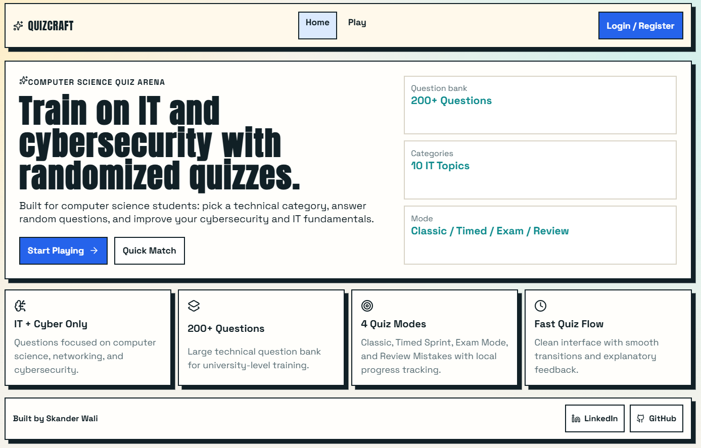
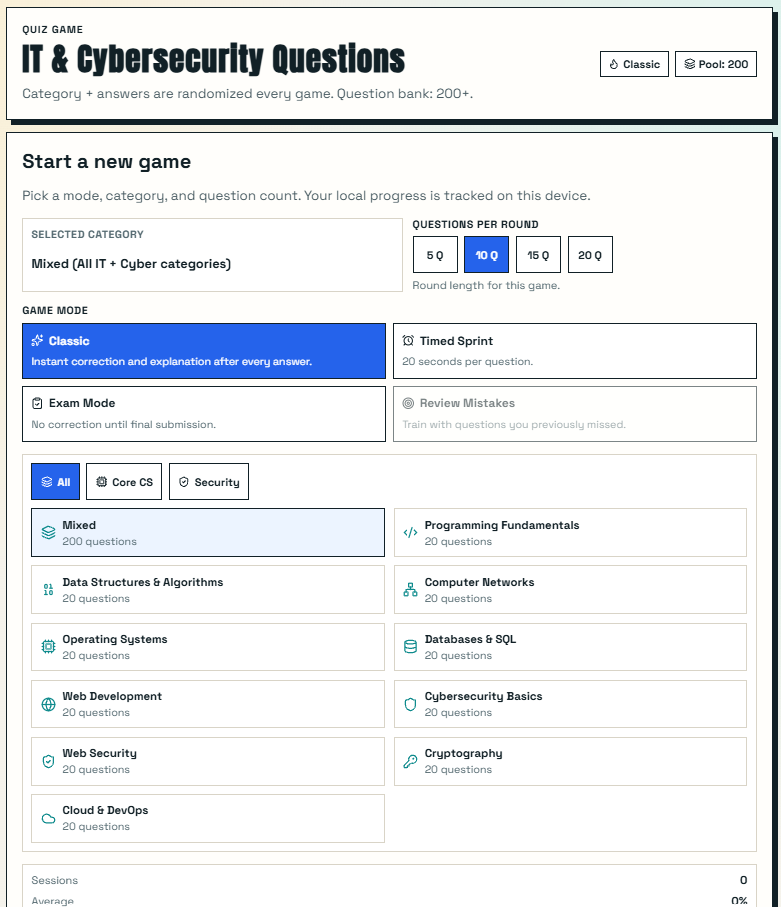
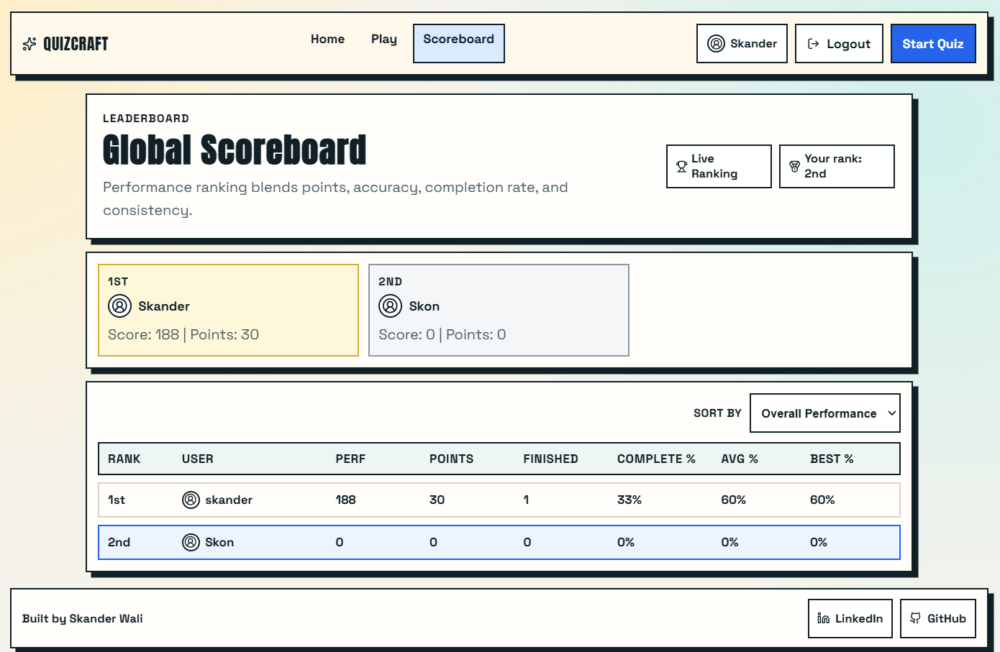
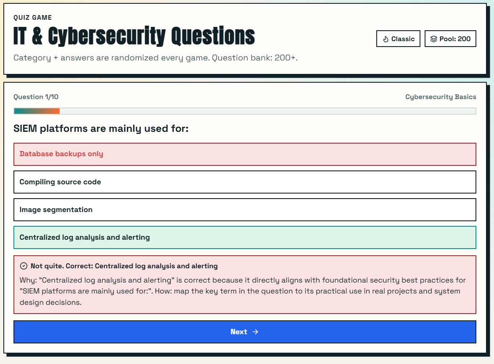

# QuizCraft - IT & Cybersecurity Quiz Platform

[](https://react.dev/)
[](https://vite.dev/)
[](https://expressjs.com/)
[](https://www.sqlite.org/)
[](https://www.framer.com/motion/)
[](https://reactrouter.com/)
[](https://eslint.org/)
[](#mobile-optimization)
[](#authentication)
[](#progress-tracking)

A modern quiz web app focused on **Computer Science** and **Cybersecurity** topics.

**Live demo:** https://quiz-craft-brown.vercel.app/

It includes randomized questions, smooth transitions, multiple quiz modes, authentication, scoring + leaderboard, an admin dashboard, and a responsive mobile-friendly UI.

## Live Product Scope

- IT/Cyber only question bank (no generic trivia).
- 4 quiz modes:
1. Classic
2. Timed Sprint
3. Exam Mode
4. Review Mistakes
- Randomized questions and answer options each run.
- Explanations after answers (or at final submission in Exam mode).
- Final score + detailed wrong answer review.
- Register + login with SQLite-backed user accounts.
- User profile picture URL support (with default icon fallback).
- Backend score tracking with leaderboard ranking.
- Admin dashboard to inspect users and attempts (finished, in progress, abandoned).
- Progress stored locally in the browser, separated per logged-in user.
- Contact footer links (LinkedIn + GitHub).

## Tech Stack

- **Frontend:** React 19 + Vite
- **Backend:** Express + SQLite
- **Routing:** React Router v7
- **Animation:** Framer Motion
- **Icons:** Lucide React
- **State/Data:** React hooks + localStorage + REST API + SQLite scoring
- **Linting:** ESLint

## Project Structure

```text
Quiz Adaptatif Apprentissage/
  README.md
  backend/
    package.json
    .env.example
    src/
      db.js
      server.js
  frontend/
    package.json
    index.html
    public/
      favicon.svg
      bg-main.jpg
    src/
      App.jsx
      index.css
      components/
        AppLayout.jsx
        PageTransition.jsx
      data/
        authApi.js
        authStore.js
        quizApi.js
        questions.js
        questionsExtra.js
        questionBank.js
        progressStore.js
      pages/
        AuthPage.jsx
        ScoreboardPage.jsx
        AdminPage.jsx
        LandingPage.jsx
        QuizPage.jsx
        NotFoundPage.jsx
```

## Question Bank

- Total questions: **200**
- Total categories: **10**
- Main source files:
  - `frontend/src/data/questions.js`
  - `frontend/src/data/questionsExtra.js`
- Aggregation/mapping logic:
  - `frontend/src/data/questionBank.js`

Categories include:
- Programming Fundamentals
- Data Structures & Algorithms
- Computer Networks
- Operating Systems
- Databases & SQL
- Web Development
- Cybersecurity Basics
- Web Security
- Cryptography
- Cloud & DevOps

## Quiz Modes

### 1) Classic
- Instant feedback per question
- Explanation shown immediately

### 2) Timed Sprint
- 20 seconds per question
- Timeout auto-submits as no answer

### 3) Exam Mode
- No instant feedback
- Full review shown at the end

### 4) Review Mistakes
- Pulls from previously missed questions
- Uses local stats to create a focused drill set

## Authentication

Backend auth endpoints (Express):
- `POST /api/auth/register`
- `POST /api/auth/login`
- `GET /api/auth/me`
- `PATCH /api/auth/profile` (update name/avatar URL)

Users are stored in SQLite:
- `backend/data/quizcraft.db`

JWT is returned on login/register and stored on the frontend.

## Score System + Leaderboard

Round points are computed server-side:
- `base = correctAnswers * 10 + perfectBonus + volumeBonus`
- `perfectBonus = +25 if score is 100%`
- `volumeBonus = +5 for 10+ questions, +10 for 15+`
- final points use mode multipliers:
  - `classic = 1.0`
  - `timed = 1.2`
  - `exam = 1.35`
  - `review = 0.9`

Quiz attempt endpoints:
- `POST /api/attempts/start`
- `PATCH /api/attempts/:attemptId/finish`
- `PATCH /api/attempts/:attemptId/abandon`

Leaderboard endpoint:
- `GET /api/leaderboard?sort=performance|points|accuracy|completion`

## Admin Dashboard

Admin-only endpoints:
- `GET /api/admin/overview`
- `GET /api/admin/users`
- `GET /api/admin/users/:userId/attempts`

How admin is assigned:
- By default, account `admin@example.com` is promoted as admin.
- You can override this with `ADMIN_EMAIL` in backend `.env`.

How to access admin dashboard:
1. Login with your admin account (`ADMIN_EMAIL`).
2. Open `/admin` directly, or click **Admin** in the top nav (visible only to admins).

## Progress Tracking

Implemented in:
- `frontend/src/data/progressStore.js`

Stored in browser localStorage (scoped per user ID):
- Session history
- Per-question stats (attempts/correct/wrong)
- Per-topic stats
- Drill pool for mistake review

Progress remains frontend-local for simplicity.
Score and attempt tracking are persisted in SQLite for leaderboard/admin reporting.

## Mobile Optimization

The app includes mobile-focused improvements:
- Larger touch targets (44px+)
- Better stacked nav/actions on small screens
- Cleaner card layouts for quiz setup and results
- Sticky primary action button in question flow on very small screens
- Reduced visual noise effects on compact devices

## Getting Started

### Prerequisites

- Node.js 18+ recommended
- npm 9+ recommended

### 1) Install dependencies

```bash
# backend
cd backend
npm install

# frontend
cd ../frontend
npm install
```

### 2) Configure backend env (optional for local dev)

```bash
cd backend
copy .env.example .env
```

If `.env` is missing, defaults still work locally (`PORT=4000`, default admin email `admin@example.com`).

### 3) Run development servers

Backend terminal:

```bash
cd backend
npm run dev
```

Frontend terminal:

```bash
cd frontend
npm run dev
```

Frontend dev server proxies `/api` calls to `http://localhost:4000`.

### Production Build (Frontend)

```bash
cd frontend
npm run build
npm run preview
```

### Lint (Frontend)

```bash
cd frontend
npm run lint
```

## Available Scripts

From `frontend/package.json`:
- `npm run dev` - Start Vite dev server
- `npm run build` - Build production bundle
- `npm run preview` - Preview production build locally
- `npm run lint` - Run ESLint

From `backend/package.json`:
- `npm run dev` - Start API server in watch mode
- `npm start` - Start API server

## Common Issue

If you see:

`npm ERR! enoent Could not read package.json`

You are likely running npm in the repo root.

Fix:

```bash
cd frontend
npm run dev
```

## Customization Guide

### Update questions

Edit:
- `frontend/src/data/questions.js`
- `frontend/src/data/questionsExtra.js`

Then the app automatically rebuilds topic metadata from `questionBank.js`.

### Update quiz behavior

Edit:
- `frontend/src/pages/QuizPage.jsx`

Examples:
- Timer duration (`TIMED_QUESTION_SECONDS`)
- Question count presets (`QUESTION_COUNTS`)
- Mode labels/descriptions (`MODE_OPTIONS`)

### Update visual theme

Edit:
- `frontend/src/index.css`
- `frontend/index.html` (fonts)
- `frontend/public/favicon.svg` (favicon)

## Routes

Defined in `frontend/src/App.jsx`:

- `/` -> Landing page
- `/auth` -> Register/Login page
- `/play` -> Quiz experience (protected, requires login)
- `/scoreboard` -> User leaderboard (protected)
- `/admin` -> Admin dashboard (admin only)
- `/quiz` -> Redirects to `/play`
- `*` -> Not Found page

## Screenshots






## Current Product Status

This is a **small full-stack product** with:
- frontend quiz gameplay
- backend auth API
- SQLite user database
- backend score + leaderboard system
- admin dashboard for user/attempt monitoring
- local quiz progress persistence per account (browser storage)

It is ideal for:
- portfolio/demo use
- student self-practice
- rapid iteration before backend integration

## Author / Contacts

- LinkedIn: <https://www.linkedin.com/in/skander-wali-901040391/>
- GitHub: <https://github.com/dustin04x>
